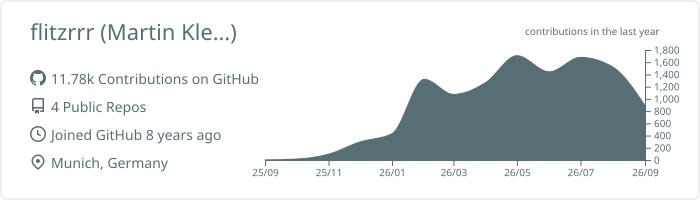
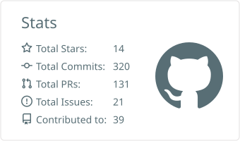
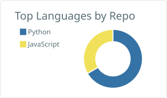
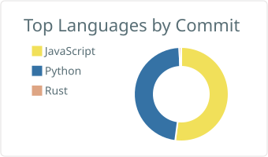
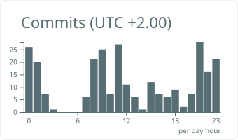

 

&nbsp;

&nbsp;

&nbsp;

---

### About

I build platforms, automation, and AI-powered tooling — clean architecture,
reliable pipelines, and pragmatic solutions that scale. I work across the full
stack and ship the same product natively to web, mobile, TV, and desktop.
Based in **Munich, Germany**.

> Building platforms by day, automating everything by night.

---

### Tech Stack

<table>
<tr>
<td width="33%" valign="top">

**Languages**

</td>
<td width="33%" valign="top">

**Frameworks & Runtime**

</td>
<td width="33%" valign="top">

**Infra & Data**

</td>
</tr>
</table>

---

### What I Build

<table>
<tr>
<td width="50%" valign="top">

<h4>AI &amp; Agent Engineering</h4>

- Agent orchestration frameworks and MCP servers
- Curated skill libraries for AI coding assistants
- Evaluation and benchmarking of agentic systems
- Browser extensions for LLM-friendly content extraction
- Natural-language-to-action execution pipelines

<h4>Platform Engineering</h4>

- Multi-tenant identity and API platforms
- Cross-environment deployment orchestration
- OAuth2 / OIDC automation across environments
- Reverse proxy middleware and traffic management
- Infrastructure cost analysis and dependency mapping

</td>
<td width="50%" valign="top">

<h4>Full-Stack &amp; Multi-Platform Apps</h4>

- Web applications and e-commerce platforms
- Native apps across iOS, Android, TV, desktop, and web
- Design systems with zero-runtime CSS architectures
- Real-time data pipelines and scheduled reporting
- Document processing automation (DOCX, Excel, PDF)

<h4>DevOps &amp; Automation</h4>

- CI/CD pipelines with GitHub Actions and containers
- Automated QA with BDD and integration testing
- Dataset lifecycle management and compliance tooling
- Cloud resource inventory and environment restoration
- Operational CLI toolkits for bulk API management

</td>
</tr>
</table>

---

### GitHub in Numbers

<!-- Static cards generated daily by GitHub Actions from PUBLIC data only. -->

<picture>
  <source media="(prefers-color-scheme: dark)" srcset="./profile-summary-card-output/github_dark/0-profile-details.svg">
  
</picture>

 

<picture>
  <source media="(prefers-color-scheme: dark)" srcset="./profile-summary-card-output/github_dark/3-stats.svg">
  
</picture>
<picture>
  <source media="(prefers-color-scheme: dark)" srcset="./profile-summary-card-output/github_dark/1-repos-per-language.svg">
  
</picture>

 

<picture>
  <source media="(prefers-color-scheme: dark)" srcset="./profile-summary-card-output/github_dark/2-most-commit-language.svg">
  
</picture>
<picture>
  <source media="(prefers-color-scheme: dark)" srcset="./profile-summary-card-output/github_dark/4-productive-time.svg">
  
</picture>

---

### Current Focus

- **Agentic AI** — Orchestration frameworks, MCP servers, and evaluation harnesses for autonomous coding agents
- **Multi-platform native development** — Same product, natively implemented across iOS, Android, smart TVs, and desktop
- **Platform reliability** — Deployment orchestration, environment lifecycle, and infrastructure automation
- **Enterprise automation** — Document processing pipelines, scheduled reporting, and bulk API operations
- **Open-source tooling** — Agent skills, web crawlers, and developer productivity tools

---

<!-- Contribution snake — committed to the `output` branch by GitHub Actions. -->
<picture>
  <source media="(prefers-color-scheme: dark)" srcset="https://raw.githubusercontent.com/flitzrrr/flitzrrr/output/github-snake-dark.svg">
  <source media="(prefers-color-scheme: light)" srcset="https://raw.githubusercontent.com/flitzrrr/flitzrrr/output/github-snake.svg">
  
</picture>

  

